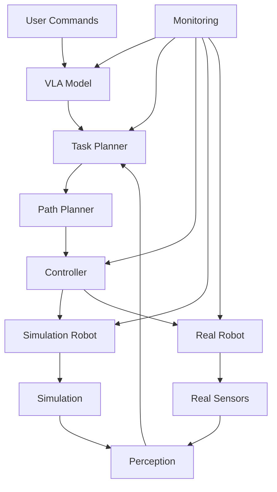

# Integrated System Design

## Learning Objectives

By the end of this chapter, you will be able to:
- Design an integrated robotic system combining all course modules
- Implement communication protocols between different system components
- Create a unified architecture for ROS 2, simulation, Isaac Sim, and VLA components
- Evaluate system integration challenges and solutions

## Introduction

The capstone project requires integrating all components learned throughout the course into a cohesive robotic system. This chapter focuses on the architectural design of such integrated systems, addressing the challenges of connecting diverse technologies into a unified platform.

## System Architecture Overview

### Theoretical Background

An integrated robotic system combines perception, planning, control, and interaction components into a unified architecture. Each component must communicate effectively while maintaining real-time performance and safety constraints.

### Practical Implementation

The system architecture typically follows a service-oriented or component-based design with well-defined interfaces between different modules.

### Key Considerations

- Real-time performance requirements
- Safety and fault tolerance
- Scalability and maintainability
- Debugging and monitoring capabilities

## Integration Patterns

### Theoretical Background

Integration patterns define how different system components communicate and coordinate. Common patterns include publish-subscribe, request-response, and event-driven architectures.

### Practical Implementation

ROS 2 provides the infrastructure for implementing these patterns with topics, services, and actions as communication primitives.

### Key Considerations

- Message passing efficiency
- Network topology and latency
- Synchronization between components

## ROS 2 as Integration Framework

### Theoretical Background

ROS 2 serves as the middleware that enables communication between all system components, providing a unified interface for data exchange and service calls.

### Practical Implementation

Different modules (perception, planning, control) run as ROS 2 nodes that communicate through standardized message types.

### Key Considerations

- Quality of Service (QoS) configuration
- Network discovery and configuration
- Message type standardization

## Simulation and Real-World Integration

### Theoretical Background

Bridging simulation and real-world deployment requires careful consideration of the sim-to-real gap and appropriate abstraction layers.

### Practical Implementation

Simulation and real robot interfaces are abstracted to allow the same high-level logic to work in both environments.

### Key Considerations

- Sensor data consistency
- Control command translation
- Timing and synchronization

## Diagrams and Visualizations



## Conceptual Code Examples

### Integrated System Node
```python
import rclpy
from rclpy.node import Node
from std_msgs.msg import String
from geometry_msgs.msg import PoseStamped
from sensor_msgs.msg import Image, CameraInfo
from nav2_msgs.action import NavigateToPose
from rclpy.action import ActionClient
import numpy as np

class IntegratedRobotSystem(Node):
    def __init__(self):
        super().__init__('integrated_robot_system')

        # Subscriptions for different modalities
        self.vision_sub = self.create_subscription(
            Image,
            'camera/image_raw',
            self.vision_callback,
            10
        )

        self.language_sub = self.create_subscription(
            String,
            'natural_language_command',
            self.language_callback,
            10
        )

        # Publishers for system status
        self.status_pub = self.create_publisher(
            String,
            'system_status',
            10
        )

        # Action client for navigation
        self.nav_client = ActionClient(
            self,
            NavigateToPose,
            'navigate_to_pose'
        )

        # Internal state
        self.current_task = None
        self.robot_pose = None
        self.vision_data = None

        # Timer for system coordination
        self.system_timer = self.create_timer(0.1, self.system_update)

    def vision_callback(self, msg):
        """Process visual input from robot camera"""
        # In a real implementation, this would process the image
        # and extract relevant information for the VLA system
        self.vision_data = msg
        self.get_logger().info('Received vision data')

    def language_callback(self, msg):
        """Process natural language commands"""
        command = msg.data
        self.get_logger().info(f'Received command: {command}')

        # Here you would integrate with VLA model to interpret command
        # and generate appropriate robot actions
        self.process_language_command(command)

    def process_language_command(self, command):
        """Process and execute language commands"""
        # This would interface with the VLA model
        # For now, we'll simulate command processing
        if "go to" in command.lower():
            # Extract target location from command (simplified)
            target = self.extract_target_location(command)
            if target:
                self.execute_navigation(target)

    def extract_target_location(self, command):
        """Extract target location from natural language"""
        # Simplified location extraction
        # In practice, this would use NLP techniques
        if "kitchen" in command.lower():
            return [2.0, 1.0, 0.0]  # x, y, theta
        elif "living room" in command.lower():
            return [0.0, 2.0, 1.57]  # x, y, theta
        else:
            return [1.0, 1.0, 0.0]  # default location

    def execute_navigation(self, target_pose):
        """Execute navigation to target pose"""
        if not self.nav_client.wait_for_server(timeout_sec=1.0):
            self.get_logger().error('Navigation action server not available')
            return

        goal_msg = NavigateToPose.Goal()
        goal_msg.pose.header.frame_id = 'map'
        goal_msg.pose.header.stamp = self.get_clock().now().to_msg()
        goal_msg.pose.pose.position.x = target_pose[0]
        goal_msg.pose.pose.position.y = target_pose[1]
        # Simplified orientation setting
        goal_msg.pose.pose.orientation.z = np.sin(target_pose[2]/2)
        goal_msg.pose.pose.orientation.w = np.cos(target_pose[2]/2)

        send_goal_future = self.nav_client.send_goal_async(goal_msg)
        send_goal_future.add_done_callback(self.navigation_done_callback)

    def navigation_done_callback(self, future):
        """Handle completion of navigation task"""
        goal_handle = future.result()
        result = goal_handle.get_result_async()
        result.add_done_callback(self.navigation_result_callback)

    def navigation_result_callback(self, future):
        """Process navigation result"""
        result = future.result().result
        self.get_logger().info(f'Navigation completed with result: {result}')

        # Publish system status
        status_msg = String()
        status_msg.data = 'Navigation completed'
        self.status_pub.publish(status_msg)

    def system_update(self):
        """Main system update loop"""
        # Coordinate between different system components
        # Check for new tasks, monitor system health, etc.
        pass

def main(args=None):
    rclpy.init(args=args)
    system = IntegratedRobotSystem()

    try:
        rclpy.spin(system)
    except KeyboardInterrupt:
        pass
    finally:
        system.destroy_node()
        rclpy.shutdown()

if __name__ == '__main__':
    main()
```

### System Integration Launch File
```python
# launch/integrated_system.launch.py
from launch import LaunchDescription
from launch_ros.actions import Node
from launch.actions import DeclareLaunchArgument
from launch.substitutions import LaunchConfiguration

def generate_launch_description():
    return LaunchDescription([
        # Declare launch arguments
        DeclareLaunchArgument(
            'use_sim_time',
            default_value='false',
            description='Use simulation clock if true'
        ),

        # Integrated robot system node
        Node(
            package='integrated_robot_system',
            executable='integrated_system_node',
            name='integrated_robot_system',
            parameters=[
                {'use_sim_time': LaunchConfiguration('use_sim_time')}
            ],
            output='screen'
        ),

        # Perception node
        Node(
            package='perception_package',
            executable='perception_node',
            name='perception_node',
            parameters=[
                {'use_sim_time': LaunchConfiguration('use_sim_time')}
            ]
        ),

        # VLA interface node
        Node(
            package='vla_interface',
            executable='vla_node',
            name='vla_node',
            parameters=[
                {'use_sim_time': LaunchConfiguration('use_sim_time')}
            ]
        )
    ])
```

## Step-by-Step Tutorial

### Designing an Integrated Robotic System

#### Prerequisites

- Understanding of all course modules
- ROS 2 development experience
- System architecture knowledge

#### Steps

1. Define system requirements and constraints
2. Design component interfaces and communication patterns
3. Implement core integration layer
4. Connect individual modules (ROS 2, simulation, VLA)
5. Test system integration and coordination
6. Implement monitoring and debugging tools

## Common Errors and Troubleshooting

### Error 1: Message Type Incompatibility
- **Cause**: Different modules using incompatible message types
- **Solution**: Standardize message types and use appropriate converters

### Error 2: Timing and Synchronization Issues
- **Cause**: Components operating at different frequencies
- **Solution**: Implement proper buffering and synchronization mechanisms

### Error 3: System Overload
- **Cause**: Too many components competing for resources
- **Solution**: Implement resource management and prioritization

## Hands-on Exercise

Design and implement a basic integrated system connecting perception, planning, and control components.

### Requirements
- ROS 2 environment
- Understanding of all course modules
- Simulation environment access

### Tasks
1. Design system architecture with component interfaces
2. Implement basic communication between components
3. Integrate perception and planning modules
4. Add VLA-based command interpretation
5. Test system coordination and error handling

### Expected Outcome
Students should have a working integrated system that demonstrates coordination between different robotic modules.

## Summary

Integrated system design requires careful consideration of interfaces, communication patterns, and coordination mechanisms. The success of complex robotic systems depends on effective integration of perception, planning, control, and interaction components.

## Further Reading

- System architecture patterns for robotics
- ROS 2 integration best practices
- Large-scale robotic system design

## References

- ROS 2 design principles
- System integration methodologies
- Robotics software architecture patterns