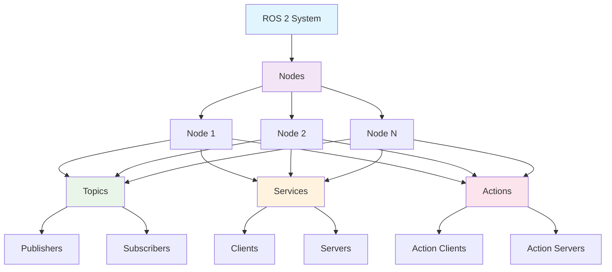
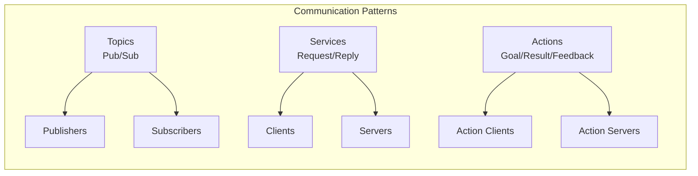
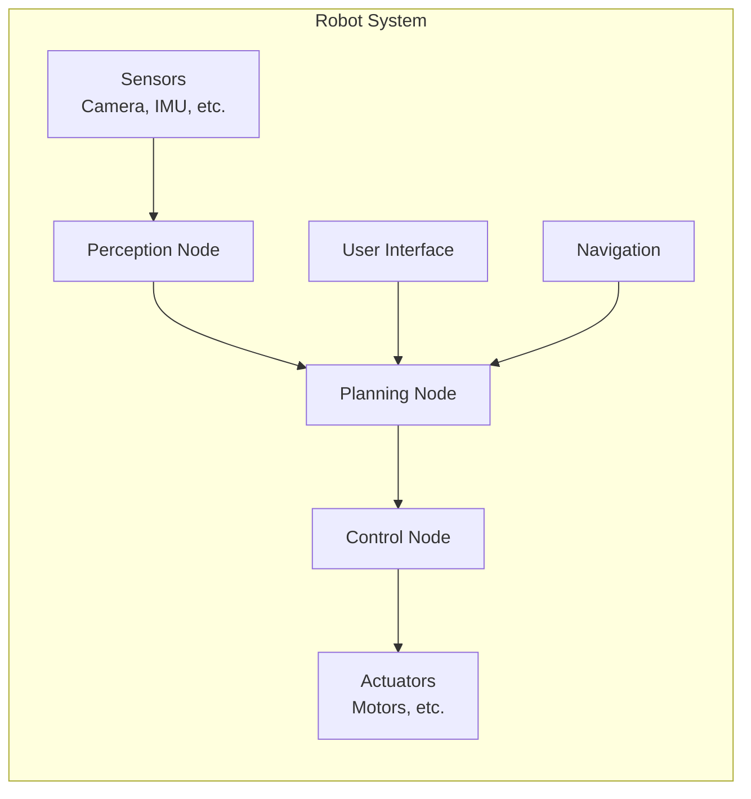

# Mermaid Diagram Example - ROS 2 Architecture

## ROS 2 System Architecture Diagram

Here's an example of a Mermaid diagram showing the ROS 2 architecture:

## Communication Patterns in ROS 2

The following diagram shows the different communication patterns available in ROS 2:

## Simple Robot Control Architecture

This diagram illustrates a simple robot control architecture using ROS 2:

## Understanding Mermaid Diagrams

Mermaid diagrams allow us to visualize complex systems and relationships in our robotics applications. They are particularly useful for:

1. **System Architecture**: Showing how different ROS 2 nodes communicate
2. **Workflow Visualization**: Illustrating the flow of data and control
3. **State Machines**: Representing robot behaviors and transitions
4. **Network Topology**: Displaying how different components are connected

These diagrams can be embedded directly in your documentation to help others understand your robotic systems better.