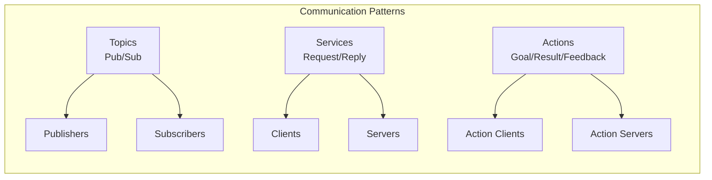

# ROS 2 Communication Patterns

## Learning Objectives

By the end of this chapter, you will be able to:
- Understand the different communication patterns available in ROS 2
- Implement publisher-subscriber communication for real-time data exchange
- Use services for request-response interactions
- Apply actions for long-running tasks with feedback

## Introduction

Communication patterns form the backbone of ROS 2 systems, enabling different nodes to exchange information and coordinate activities. This chapter explores the three primary communication patterns: topics (publish/subscribe), services (request/reply), and actions (goal/result/feedback).

## Topics: Publish-Subscribe Pattern

### Theoretical Background

The publish-subscribe pattern in ROS 2 allows nodes to communicate asynchronously through topics. Publishers send messages to topics without knowledge of subscribers, and subscribers receive messages from topics without knowledge of publishers. This decoupling enables flexible system architectures.

### Practical Implementation

In ROS 2, topics are implemented using DDS (Data Distribution Service) middleware, providing configurable Quality of Service (QoS) policies for reliability, durability, and other characteristics.

### Key Considerations

- Message ordering and synchronization
- QoS policy matching between publishers and subscribers
- Network bandwidth and real-time constraints

## Services: Request-Reply Pattern

### Theoretical Background

Services provide synchronous request-reply communication between nodes. A client sends a request to a server and waits for a response, making services suitable for operations that require immediate results.

### Practical Implementation

Service communication follows a strict request-response model where each request generates exactly one response.

### Key Considerations

- Blocking vs. non-blocking service calls
- Error handling and timeout management
- Service availability and discovery

## Actions: Goal-Result-Feedback Pattern

### Theoretical Background

Actions are designed for long-running tasks that require feedback during execution. They combine aspects of both topics and services, allowing clients to send goals, receive continuous feedback, and get final results.

### Practical Implementation

Actions involve three message types: goal, feedback, and result, enabling rich interaction patterns for complex operations.

### Key Considerations

- Cancellation and preemption handling
- Feedback frequency and relevance
- State management during execution

## Diagrams and Visualizations



## Conceptual Code Examples

### Publisher Example
```python
import rclpy
from rclpy.node import Node
from std_msgs.msg import String

class MinimalPublisher(Node):
    def __init__(self):
        super().__init__('minimal_publisher')
        self.publisher_ = self.create_publisher(String, 'topic', 10)
        timer_period = 0.5  # seconds
        self.timer = self.create_timer(timer_period, self.timer_callback)
        self.i = 0

    def timer_callback(self):
        msg = String()
        msg.data = 'Hello World: %d' % self.i
        self.publisher_.publish(msg)
        self.get_logger().info('Publishing: "%s"' % msg.data)
        self.i += 1
```

### Service Server Example
```python
import rclpy
from rclpy.node import Node
from example_interfaces.srv import AddTwoInts

class MinimalService(Node):
    def __init__(self):
        super().__init__('minimal_service')
        self.srv = self.create_service(AddTwoInts, 'add_two_ints', self.add_two_ints_callback)

    def add_two_ints_callback(self, request, response):
        response.sum = request.a + request.b
        self.get_logger().info('Incoming request\na: %d b: %d' % (request.a, request.b))
        return response
```

## Step-by-Step Tutorial

### Implementing a Simple Publisher-Subscriber System

#### Prerequisites

- ROS 2 environment set up
- Basic Python programming knowledge

#### Steps

1. Create a new ROS 2 package for the example
2. Implement a publisher node that sends sensor data
3. Implement a subscriber node that processes the data
4. Configure QoS policies appropriately
5. Test the communication between nodes

## Common Errors and Troubleshooting

### Error 1: Topic Not Found
- **Cause**: Publisher and subscriber not on the same topic or network
- **Solution**: Verify topic names match exactly and check network configuration

### Error 2: QoS Profile Mismatch
- **Cause**: Publisher and subscriber QoS policies are incompatible
- **Solution**: Ensure QoS policies match or are compatible

## Hands-on Exercise

Create a ROS 2 system with multiple publishers and subscribers that simulate a simple sensor network.

### Requirements
- ROS 2 environment
- Python development setup

### Tasks
1. Create a temperature sensor publisher
2. Create a humidity sensor publisher
3. Create a data aggregator subscriber
4. Implement QoS policies appropriate for sensor data

### Expected Outcome
Students should have a working multi-node ROS 2 system with proper communication patterns.

## Summary

ROS 2 communication patterns provide the foundation for distributed robotic systems. Understanding topics, services, and actions is crucial for designing effective robot architectures.

## Further Reading

- ROS 2 documentation on communication patterns
- DDS specification and QoS policies
- Real-time considerations in ROS 2 systems

## References

- ROS 2 Design: Client Server Communication Abstractions
- DDS specification for real-time systems