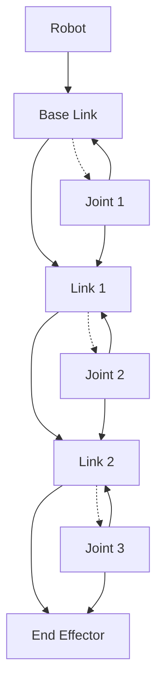

# URDF Robot Modeling

## Learning Objectives

By the end of this chapter, you will be able to:
- Create robot models using URDF (Unified Robot Description Format)
- Define kinematic chains and joint properties
- Specify visual and collision properties for robot links
- Integrate URDF models with ROS 2 simulation systems

## Introduction

URDF (Unified Robot Description Format) is an XML-based format for representing robot models in ROS. It describes the kinematic and dynamic properties of a robot, as well as its visual and collision properties. This chapter covers the fundamentals of creating and using URDF models in ROS 2 systems.

## Robot Description Fundamentals

### Theoretical Background

URDF represents robots as a tree structure of rigid links connected by joints. Each link can have visual, collision, and inertial properties, while joints define the relationship between links. This representation enables simulation, visualization, and control of robot systems.

### Practical Implementation

URDF files are loaded by ROS 2 nodes such as robot_state_publisher to provide transform information for the robot's kinematic structure.

### Key Considerations

- Kinematic chain structure and joint limits
- Mass properties and center of mass
- Collision detection vs. visual representation

## URDF Structure and Components

### Theoretical Background

A URDF model consists of links, joints, and additional elements like materials, transmissions, and Gazebo-specific extensions. Links represent rigid bodies, while joints define the kinematic relationship between links.

### Practical Implementation

URDF files follow a specific XML structure with required and optional elements for describing robot components.

### Key Considerations

- Proper naming conventions for links and joints
- Consistent units (meters for length, kilograms for mass)
- Correct parent-child relationships in the kinematic tree

## Joint Types and Kinematics

### Theoretical Background

URDF supports several joint types including revolute (rotational with limits), continuous (rotational without limits), prismatic (linear), fixed (no movement), and floating joints. Each joint type has specific properties that define its behavior.

### Practical Implementation

Joint definitions include properties like axis of rotation, limits, and safety controllers.

### Key Considerations

- Joint limit specifications and safety margins
- Kinematic chain consistency
- Computational efficiency for kinematic solvers

## Diagrams and Visualizations



## Conceptual Code Examples

### Basic URDF Example
```xml
<?xml version="1.0"?>
<robot name="simple_robot">
  <material name="blue">
    <color rgba="0.0 0.0 0.8 1.0"/>
  </material>

  <link name="base_link">
    <visual>
      <geometry>
        <box size="0.5 0.5 0.2"/>
      </geometry>
      <material name="blue"/>
    </visual>
    <collision>
      <geometry>
        <box size="0.5 0.5 0.2"/>
      </geometry>
    </collision>
    <inertial>
      <mass value="1"/>
      <inertia ixx="1" ixy="0" ixz="0" iyy="1" iyz="0" izz="1"/>
    </inertial>
  </link>

  <joint name="base_to_wheel" type="continuous">
    <parent link="base_link"/>
    <child link="wheel_link"/>
    <axis xyz="0 1 0"/>
    <origin xyz="0 0.25 -0.1"/>
  </joint>

  <link name="wheel_link">
    <visual>
      <geometry>
        <cylinder radius="0.1" length="0.05"/>
      </geometry>
    </visual>
    <collision>
      <geometry>
        <cylinder radius="0.1" length="0.05"/>
      </geometry>
    </collision>
    <inertial>
      <mass value="0.2"/>
      <inertia ixx="0.001" ixy="0" ixz="0" iyy="0.001" iyz="0" izz="0.001"/>
    </inertial>
  </link>
</robot>
```

### Robot State Publisher Node
```python
import rclpy
from rclpy.node import Node
from geometry_msgs.msg import TransformStamped
from tf2_ros import TransformBroadcaster
import tf2_ros
import geometry_msgs.msg
import time

class StatePublisher(Node):
    def __init__(self):
        super().__init__('state_publisher')
        self.br = TransformBroadcaster(self)
        self.timer = self.create_timer(0.1, self.broadcast_transform)

    def broadcast_transform(self):
        t = TransformStamped()

        t.header.stamp = self.get_clock().now().to_msg()
        t.header.frame_id = 'world'
        t.child_frame_id = 'base_link'

        t.transform.translation.x = 0.0
        t.transform.translation.y = 0.0
        t.transform.translation.z = 0.0
        t.transform.rotation.x = 0.0
        t.transform.rotation.y = 0.0
        t.transform.rotation.z = 0.0
        t.transform.rotation.w = 1.0

        self.br.sendTransform(t)
```

## Step-by-Step Tutorial

### Creating a Simple Robot Model

#### Prerequisites

- Understanding of XML syntax
- Basic knowledge of 3D geometry

#### Steps

1. Define the base link of your robot
2. Add visual and collision properties to the link
3. Create additional links for robot components
4. Define joints to connect the links
5. Add materials and colors for visualization
6. Validate the URDF file for syntax errors

## Common Errors and Troubleshooting

### Error 1: URDF Parse Error
- **Cause**: Invalid XML syntax or missing required elements
- **Solution**: Use check_urdf command to validate URDF structure

### Error 2: Kinematic Loop
- **Cause**: URDF contains closed kinematic chains
- **Solution**: Restructure as a tree with only one parent per link

### Error 3: Joint Limit Issues
- **Cause**: Joint limits exceed physical capabilities
- **Solution**: Verify joint limits match actual robot specifications

## Hands-on Exercise

Create a URDF model of a simple 3-DOF manipulator robot.

### Requirements
- Text editor for creating URDF files
- ROS 2 environment with URDF tools

### Tasks
1. Create a base link
2. Add three rotating joints with appropriate limits
3. Create links for each segment of the manipulator
4. Add visual and collision properties
5. Validate the URDF model

### Expected Outcome
Students should have a valid URDF file that represents a simple manipulator robot.

## Summary

URDF is the standard format for robot description in ROS, enabling consistent representation of robot models across simulation, visualization, and control systems. Proper URDF models are essential for effective robot development.

## Further Reading

- URDF specification and tutorials
- Xacro for parameterized robot descriptions
- Robot kinematics and dynamics in ROS

## References

- ROS URDF documentation
- Robot modeling best practices
- Xacro preprocessor for URDF