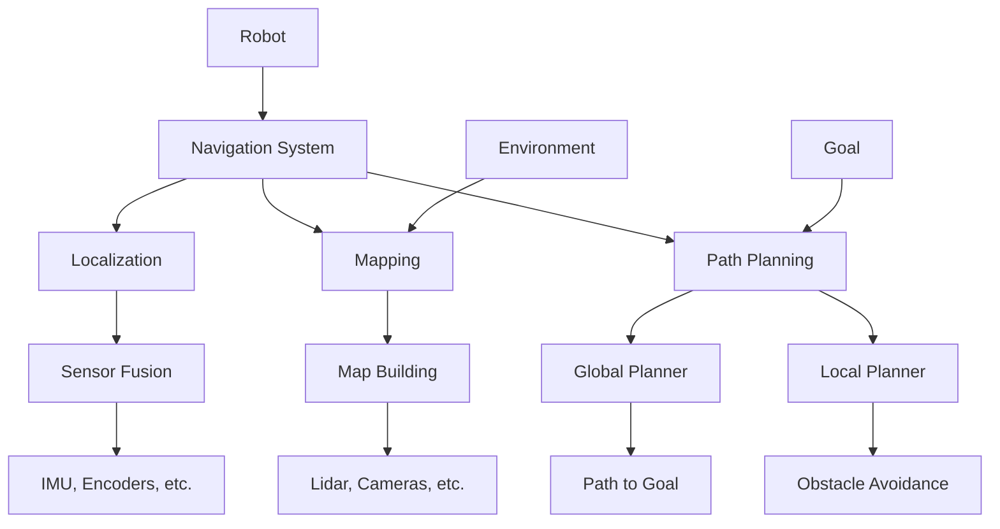

# ROS 2 Navigation Basics

## Learning Objectives

By the end of this chapter, you will be able to:
- Understand the fundamental concepts of robot navigation in ROS 2
- Implement basic localization and mapping systems
- Plan and execute robot paths using navigation algorithms
- Integrate sensors for navigation tasks

## Introduction

Navigation is a critical capability for mobile robots, enabling them to move autonomously from one location to another. In ROS 2, the Navigation2 stack provides a comprehensive framework for robot navigation, building on the lessons learned from the original ROS Navigation stack.

## Navigation System Components

### Theoretical Background

Robot navigation typically involves three main components: localization (knowing where the robot is), mapping (knowing what the environment looks like), and path planning (determining how to get from A to B). These components work together to enable autonomous navigation.

### Practical Implementation

The Navigation2 stack in ROS 2 provides modular components that can be configured for different robot platforms and environments.

### Key Considerations

- Sensor requirements for navigation tasks
- Computational complexity and real-time constraints
- Safety and obstacle avoidance

## Localization in ROS 2

### Theoretical Background

Localization is the process of determining a robot's position and orientation in a known or unknown environment. Common approaches include Monte Carlo Localization (particle filters) and Extended Kalman Filters.

### Practical Implementation

ROS 2 uses the robot_localization package for sensor fusion and state estimation, combining data from various sensors like IMUs, wheel encoders, and visual sensors.

### Key Considerations

- Sensor accuracy and noise characteristics
- Initial pose estimation
- Computational efficiency

## Mapping and SLAM

### Theoretical Background

Simultaneous Localization and Mapping (SLAM) allows robots to build a map of an unknown environment while simultaneously localizing themselves within it. This is essential for truly autonomous robots.

### Practical Implementation

ROS 2 supports various SLAM approaches through packages like slam_toolbox and cartographer_ros.

### Key Considerations

- Map quality and consistency
- Real-time performance requirements
- Loop closure and drift correction

## Path Planning and Execution

### Theoretical Background

Path planning involves finding a collision-free path from a start to a goal position. This can be done using global planners (for overall path) and local planners (for obstacle avoidance).

### Practical Implementation

Navigation2 includes various planning algorithms and provides a plugin-based architecture for custom planners.

### Key Considerations

- Planning efficiency and completeness
- Dynamic obstacle handling
- Robot kinematic constraints

## Diagrams and Visualizations



## Conceptual Code Examples

### Simple Navigation Node
```python
import rclpy
from rclpy.action import ActionClient
from rclpy.node import Node
from geometry_msgs.msg import PoseStamped
from nav2_msgs.action import NavigateToPose

class NavigateToPoseClient(Node):
    def __init__(self):
        super().__init__('navigate_to_pose_client')
        self.action_client = ActionClient(
            self,
            NavigateToPose,
            'navigate_to_pose')

    def send_goal(self, x, y, theta):
        goal_msg = NavigateToPose.Goal()
        goal_msg.pose.header.frame_id = 'map'
        goal_msg.pose.header.stamp = self.get_clock().now().to_msg()
        goal_msg.pose.pose.position.x = x
        goal_msg.pose.pose.position.y = y
        goal_msg.pose.pose.orientation.z = theta  # Simplified orientation

        self.action_client.wait_for_server()
        send_goal_future = self.action_client.send_goal_async(goal_msg)
        send_goal_future.add_done_callback(self.goal_response_callback)

    def goal_response_callback(self, future):
        goal_handle = future.result()
        if not goal_handle.accepted:
            self.get_logger().info('Goal rejected :(')
            return

        self.get_logger().info('Goal accepted :)')
        result_future = goal_handle.get_result_async()
        result_future.add_done_callback(self.get_result_callback)

    def get_result_callback(self, future):
        result = future.result().result
        self.get_logger().info('Result: {0}'.format(result))

def main(args=None):
    rclpy.init(args=args)

    # Create navigation client
    navigate_to_pose_client = NavigateToPoseClient()

    # Send a navigation goal
    navigate_to_pose_client.send_goal(1.0, 1.0, 0.0)  # Navigate to (1,1) with 0 rotation

    # Keep the node alive to receive callbacks
    rclpy.spin(navigate_to_pose_client)
    navigate_to_pose_client.destroy_node()
    rclpy.shutdown()

if __name__ == '__main__':
    main()
```

## Step-by-Step Tutorial

### Setting Up Basic Navigation

#### Prerequisites

- ROS 2 Navigation2 stack installed
- Robot with appropriate sensors (lidar, IMU, odometry)
- Working URDF model of the robot

#### Steps

1. Configure the robot's sensor setup for navigation
2. Set up the navigation launch files
3. Calibrate sensors and transforms
4. Test localization with known map
5. Test path planning and execution

## Common Errors and Troubleshooting

### Error 1: TF Tree Issues
- **Cause**: Missing or incorrect transforms between coordinate frames
- **Solution**: Verify all required transforms are published and frames are correctly named

### Error 2: Sensor Data Problems
- **Cause**: Incorrect sensor configuration or data format
- **Solution**: Check sensor topics, message types, and coordinate frames

### Error 3: Planner Failures
- **Cause**: Inadequate costmap configuration or obstacle detection
- **Solution**: Adjust costmap parameters and inflation settings

## Hands-on Exercise

Set up navigation for a simulated robot in a simple environment.

### Requirements
- Gazebo simulation environment
- Navigation2 packages installed
- Robot model with appropriate sensors

### Tasks
1. Configure costmaps for navigation
2. Set up the global and local planners
3. Test autonomous navigation to various goals
4. Evaluate navigation performance and adjust parameters

### Expected Outcome
Students should have a working navigation system that can plan and execute paths for a simulated robot.

## Summary

Navigation is a complex but essential capability for mobile robots. The Navigation2 stack in ROS 2 provides a modular and flexible framework for implementing robot navigation systems.

## Further Reading

- Navigation2 documentation and tutorials
- SLAM algorithms and implementations
- Robot motion planning algorithms

## References

- Navigation2 design documentation
- Mobile robot navigation algorithms
- Sensor fusion for localization