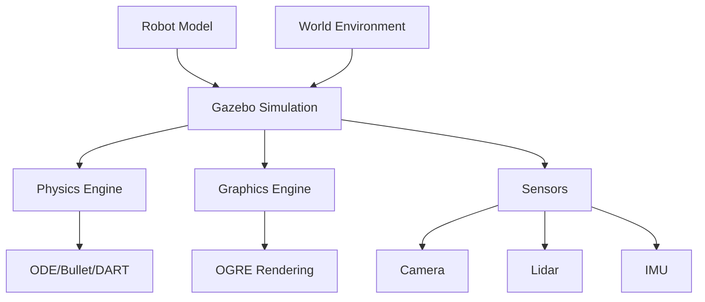

# Gazebo Physics Simulation

## Learning Objectives

By the end of this chapter, you will be able to:
- Set up and configure Gazebo simulation environments
- Model robots and environments with realistic physics properties
- Integrate sensors and actuators in simulation environments
- Optimize simulation performance and accuracy

## Introduction

Gazebo is a 3D simulation environment for robotics that provides realistic physics simulation, high-quality graphics, and convenient programmatic interfaces. This chapter covers the fundamentals of using Gazebo for robotics simulation and development.

## Gazebo Architecture and Concepts

### Theoretical Background

Gazebo is built on the OGRE graphics engine and uses physics engines like ODE, Bullet, and DART for accurate simulation. It provides a plugin architecture that allows for custom sensors, controllers, and world elements.

### Practical Implementation

Gazebo worlds are defined using SDF (Simulation Description Format), an XML-based format that describes the environment, models, lighting, and physics properties.

### Key Considerations

- Physics engine selection and configuration
- Realism vs. performance trade-offs
- Plugin architecture for extensibility

## Robot Model Integration

### Theoretical Background

Robots in Gazebo are typically described using URDF (Unified Robot Description Format) with additional Gazebo-specific tags for physics properties, sensors, and plugins.

### Practical Implementation

URDF models are converted to SDF format internally by Gazebo, with additional Gazebo-specific elements for simulation behavior.

### Key Considerations

- Collision vs. visual mesh optimization
- Inertial property accuracy
- Joint dynamics and friction

## Sensor Simulation

### Theoretical Background

Gazebo provides realistic simulation of various sensors including cameras, lidar, IMU, GPS, and force/torque sensors, each with configurable noise models and parameters.

### Practical Implementation

Sensors are defined in URDF/SDF with realistic parameters that match physical sensors as closely as possible.

### Key Considerations

- Sensor noise modeling
- Update rates and performance
- Field of view and range limitations

## Diagrams and Visualizations



## Conceptual Code Examples

### Basic Gazebo World Definition
```xml
<?xml version="1.0" ?>
<sdf version="1.7">
  <world name="simple_world">
    <!-- Include a default ground plane -->
    <include>
      <uri>model://ground_plane</uri>
    </include>

    <!-- Include a default light source -->
    <include>
      <uri>model://sun</uri>
    </include>

    <!-- Define a simple robot model -->
    <model name="simple_robot">
      <pose>0 0 0.5 0 0 0</pose>
      <link name="chassis">
        <inertial>
          <mass>5.0</mass>
          <inertia>
            <ixx>0.416</ixx>
            <ixy>0.0</ixy>
            <ixz>0.0</ixz>
            <iyy>0.416</iyy>
            <iyz>0.0</iyz>
            <izz>0.833</izz>
          </inertia>
        </inertial>
        <visual name="visual">
          <geometry>
            <box>
              <size>1.0 0.5 0.3</size>
            </box>
          </geometry>
        </visual>
        <collision name="collision">
          <geometry>
            <box>
              <size>1.0 0.5 0.3</size>
            </box>
          </geometry>
        </collision>
      </link>
    </model>
  </world>
</sdf>
```

### Gazebo Plugin Example
```xml
<!-- Differential drive plugin -->
<gazebo>
  <plugin name="differential_drive" filename="libgazebo_ros_diff_drive.so">
    <left_joint>left_wheel_joint</left_joint>
    <right_joint>right_wheel_joint</right_joint>
    <wheel_separation>0.3</wheel_separation>
    <wheel_diameter>0.15</wheel_diameter>
    <command_topic>cmd_vel</command_topic>
    <odometry_topic>odom</odometry_topic>
    <odometry_frame>odom</odometry_frame>
    <robot_base_frame>base_link</robot_base_frame>
  </plugin>
</gazebo>
```

## Step-by-Step Tutorial

### Setting Up a Basic Gazebo Environment

#### Prerequisites

- Gazebo installed
- Basic understanding of URDF/SDF

#### Steps

1. Create a simple world file
2. Define a basic robot model
3. Add physics properties
4. Launch the simulation
5. Verify robot behavior

## Common Errors and Troubleshooting

### Error 1: Model Not Loading
- **Cause**: Invalid SDF/URDF syntax or missing dependencies
- **Solution**: Validate XML syntax and check model paths

### Error 2: Physics Issues
- **Cause**: Incorrect inertial properties or joint limits
- **Solution**: Verify mass, inertia, and joint parameters

### Error 3: Performance Problems
- **Cause**: Complex models or high update rates
- **Solution**: Simplify collision meshes or adjust physics parameters

## Hands-on Exercise

Create a simple mobile robot simulation in Gazebo with differential drive and sensor simulation.

### Requirements
- Gazebo installed
- Basic XML editing tools

### Tasks
1. Create a robot model with chassis and wheels
2. Add differential drive plugin
3. Include a camera sensor
4. Create a simple world environment
5. Test the simulation

### Expected Outcome
Students should have a working Gazebo simulation with a mobile robot that can be controlled and sensed.

## Summary

Gazebo provides a powerful platform for robotics simulation with realistic physics and sensor modeling. Proper configuration is essential for effective robot development and testing.

## Further Reading

- Gazebo documentation and tutorials
- SDF specification
- Physics engine configuration

## References

- Gazebo project documentation
- SDF specification
- ROS integration with Gazebo