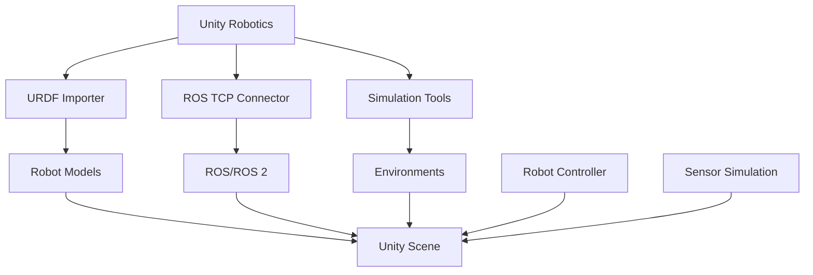

# Unity Robotics Tools

## Learning Objectives

By the end of this chapter, you will be able to:
- Set up and configure Unity for robotics applications
- Import robot models using the URDF Importer
- Create 3D environments for robot simulation
- Implement communication between Unity and ROS/ROS 2

## Introduction

Unity is a powerful 3D development platform that has gained significant traction in robotics for creating high-fidelity simulations, visualization tools, and human-robot interaction interfaces. This chapter covers the Unity Robotics tools and their application in robotics development.

## Unity Robotics Hub Setup

### Theoretical Background

The Unity Robotics Hub provides specialized tools for robotics simulation and development, including the URDF Importer, ROS TCP Connector, and various simulation tools that bridge the gap between Unity's game engine capabilities and robotics applications.

### Practical Implementation

The Unity Robotics Hub is installed through the Unity Package Manager and provides a centralized location for robotics-related packages and tools.

### Key Considerations

- Unity version compatibility
- System requirements for high-fidelity simulation
- Integration with existing ROS/ROS 2 workflows

## URDF Importer

### Theoretical Background

The URDF Importer allows developers to import robot models directly from URDF files into Unity, preserving joint structures, visual properties, and kinematic relationships.

### Practical Implementation

The URDF Importer processes URDF files and generates corresponding Unity assets with appropriate joint configurations and visual representations.

### Key Considerations

- URDF file validation and compatibility
- Mesh format requirements
- Joint type mapping between URDF and Unity

## ROS/ROS 2 Communication

### Theoretical Background

The ROS TCP Connector enables communication between Unity and ROS/ROS 2 systems, allowing for bidirectional message passing and system integration.

### Practical Implementation

Unity scripts use the ROS TCP Connector to publish and subscribe to ROS topics, call services, and handle actions.

### Key Considerations

- Network configuration and reliability
- Message serialization and performance
- Synchronization between Unity and ROS timing

## Environment Creation

### Theoretical Background

Unity's powerful rendering and physics capabilities make it ideal for creating realistic environments for robot simulation and testing.

### Practical Implementation

Environment creation involves using Unity's built-in tools for terrain generation, lighting, and asset placement.

### Key Considerations

- Realism vs. performance trade-offs
- Physics accuracy requirements
- Sensor simulation compatibility

## Diagrams and Visualizations



## Conceptual Code Examples

### ROS TCP Connector Usage
```csharp
using Unity.Robotics.ROSTCPConnector;
using RosMessageTypes.Std;
using UnityEngine;

public class UnityRobotController : MonoBehaviour
{
    ROSConnection ros;
    string rosTopicName = "unity_robot_command";

    // Start is called before the first frame update
    void Start()
    {
        // Get the ROS connection static instance
        ros = ROSConnection.instance;
    }

    void Update()
    {
        // Example: Send a message to ROS every second
        if (Time.time % 1.0f < Time.deltaTime)
        {
            // Create a message to send
            StringMsg message = new StringMsg("Unity position: " + transform.position);

            // Send the message
            ros.Send(rosTopicName, message);
        }
    }

    // Method to receive messages from ROS
    void OnMessageReceived(StringMsg msg)
    {
        Debug.Log("Received from ROS: " + msg.data);
        // Process the received message
    }
}
```

### Robot Control in Unity
```csharp
using UnityEngine;

public class SimpleRobotController : MonoBehaviour
{
    public float moveSpeed = 5.0f;
    public float turnSpeed = 100.0f;

    void Update()
    {
        // Basic movement controls (in a real application, these would come from ROS)
        float translation = Input.GetAxis("Vertical") * moveSpeed * Time.deltaTime;
        float rotation = Input.GetAxis("Horizontal") * turnSpeed * Time.deltaTime;

        transform.Translate(0, 0, translation);
        transform.Rotate(0, rotation, 0);
    }
}
```

## Step-by-Step Tutorial

### Setting Up Unity for Robotics

#### Prerequisites

- Unity Hub installed
- Unity 2021.3 LTS or later
- Basic understanding of Unity interface

#### Steps

1. Install Unity Robotics Hub
2. Create a new Unity project
3. Import a robot model using URDF Importer
4. Set up ROS TCP Connector
5. Test basic communication

## Common Errors and Troubleshooting

### Error 1: URDF Import Failure
- **Cause**: Invalid URDF syntax or unsupported joint types
- **Solution**: Validate URDF and check supported joint types

### Error 2: ROS Connection Issues
- **Cause**: Network configuration problems or ROS master not running
- **Solution**: Verify IP addresses and ensure ROS master is accessible

### Error 3: Performance Problems
- **Cause**: Complex scenes or high-frequency message passing
- **Solution**: Optimize scene complexity and message rates

## Hands-on Exercise

Create a Unity scene with an imported robot model and implement basic ROS communication.

### Requirements
- Unity installed with Robotics Hub
- ROS/ROS 2 environment
- Simple URDF robot model

### Tasks
1. Import a robot model using URDF Importer
2. Set up ROS TCP Connector
3. Implement basic robot control
4. Add sensor simulation
5. Test communication with ROS

### Expected Outcome
Students should have a Unity scene with a robot model that communicates with ROS/ROS 2.

## Summary

Unity provides powerful tools for robotics simulation and visualization, with the Unity Robotics Hub bridging the gap between Unity's capabilities and robotics requirements.

## Further Reading

- Unity Robotics documentation
- URDF Importer tutorials
- ROS TCP Connector examples

## References

- Unity Robotics Hub documentation
- Unity game engine documentation
- ROS integration guides