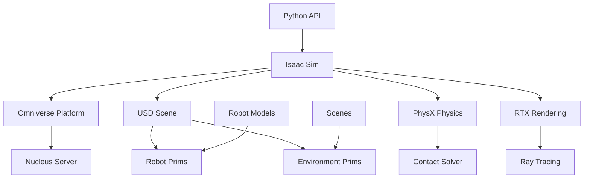

# Isaac Sim Fundamentals

## Learning Objectives

By the end of this chapter, you will be able to:
- Install and configure NVIDIA Isaac Sim for robotics applications
- Create basic simulation environments in Isaac Sim
- Import and configure robot models for simulation
- Understand the USD (Universal Scene Description) format for robotics

## Introduction

NVIDIA Isaac Sim is a comprehensive robotics simulation application built on the NVIDIA Omniverse platform. It provides high-fidelity simulation capabilities specifically designed for robotics applications, including physically accurate simulation with GPU-accelerated physics and high-quality rendering for synthetic data generation.

## Isaac Sim Architecture

### Theoretical Background

Isaac Sim is built on NVIDIA's Omniverse platform, utilizing USD (Universal Scene Description) as the foundational format for scene representation. It integrates PhysX for physics simulation, RTX for rendering, and provides a Python API for programmatic control.

### Practical Implementation

Isaac Sim runs as an extension within the Omniverse platform, providing a comprehensive environment for robotics simulation with built-in tools for scene creation, robot configuration, and data generation.

### Key Considerations

- Hardware requirements for optimal performance
- USD format understanding for scene management
- Integration with existing robotics workflows

## USD for Robotics

### Theoretical Background

USD (Universal Scene Description) is Pixar's scene description format that enables complex scene composition and collaboration. In Isaac Sim, USD provides a powerful framework for representing robots, environments, and simulation scenarios.

### Practical Implementation

Robots and environments in Isaac Sim are represented as USD files, which can be composed from multiple sub-files and modified programmatically.

### Key Considerations

- USD stage composition and layering
- Prim hierarchy and naming conventions
- Asset referencing and instancing

## Robot Import and Configuration

### Theoretical Background

Isaac Sim supports importing robots in various formats, with USD being the native format. Robots are represented as articulated systems with joints, links, and associated properties.

### Practical Implementation

Robots can be imported from URDF with conversion, or directly created as USD files with appropriate joint and link definitions.

### Key Considerations

- Joint type mapping and limits
- Mass and inertial properties
- Visual and collision mesh optimization

## Physics Simulation

### Theoretical Background

Isaac Sim uses NVIDIA PhysX for physics simulation, providing accurate rigid body dynamics, contact simulation, and constraint solving. The GPU acceleration enables complex multi-body simulations.

### Practical Implementation

Physics properties are configured through USD prim attributes and can be modified at runtime through the Python API.

### Key Considerations

- Performance vs. accuracy trade-offs
- Contact material properties
- Constraint stability and solver parameters

## Diagrams and Visualizations



## Conceptual Code Examples

### Basic Isaac Sim World Setup
```python
import omni
import carb
from omni.isaac.core import World
from omni.isaac.core.utils.stage import add_reference_to_stage
from omni.isaac.core.utils.nucleus import get_assets_root_path
from omni.isaac.core.robots import Robot

# Create a world instance
world = World(stage_units_in_meters=1.0)

# Get the assets root path
assets_root_path = get_assets_root_path()

if assets_root_path is not None:
    # Add a robot to the simulation
    add_reference_to_stage(
        usd_path=assets_root_path + "/Isaac/Robots/Franka/franka.usd",
        prim_path="/World/Franka"
    )

    # Add a table
    add_reference_to_stage(
        usd_path=assets_root_path + "/Isaac/Props/Table/table.usd",
        prim_path="/World/Table"
    )

# Reset and step the simulation
world.reset()
for i in range(100):
    world.step(render=True)

# Clean up
world.clear()
```

### Robot Control in Isaac Sim
```python
import numpy as np
from omni.isaac.core import World
from omni.isaac.core.robots import Robot
from omni.isaac.core.utils.stage import add_reference_to_stage
from ommi.isaac.core.utils.nucleus import get_assets_root_path

def setup_robot_control():
    world = World(stage_units_in_meters=1.0)
    assets_root_path = get_assets_root_path()

    if assets_root_path is not None:
        # Add robot to stage
        add_reference_to_stage(
            usd_path=assets_root_path + "/Isaac/Robots/Carter/carter_model.usd",
            prim_path="/World/Carter"
        )

        # Create robot object for control
        robot = Robot(prim_path="/World/Carter", name="carter_bot")

        # Reset the world
        world.reset()

        # Example control loop
        for i in range(1000):
            # Get current position
            current_position, current_orientation = robot.get_world_pose()

            # Simple control logic
            if i < 500:
                # Move forward
                robot.apply_wheel_actions(
                    wheel_velocities=[10.0, 10.0],  # left, right wheel velocities
                    wheel_indices=[0, 1]
                )
            else:
                # Stop
                robot.apply_wheel_actions(
                    wheel_velocities=[0.0, 0.0],
                    wheel_indices=[0, 1]
                )

            world.step(render=True)

    world.clear()
```

## Step-by-Step Tutorial

### Setting Up Your First Isaac Sim Environment

#### Prerequisites

- NVIDIA GPU with CUDA support
- Isaac Sim installed via Omniverse Launcher
- Understanding of robotics concepts

#### Steps

1. Launch Isaac Sim through Omniverse
2. Create a new USD stage
3. Import a robot model
4. Add environmental objects
5. Configure physics properties
6. Run the simulation

## Common Errors and Troubleshooting

### Error 1: Performance Issues
- **Cause**: Insufficient GPU resources or complex scenes
- **Solution**: Reduce scene complexity or adjust rendering settings

### Error 2: Robot Import Problems
- **Cause**: Invalid USD files or missing assets
- **Solution**: Verify asset paths and USD file validity

### Error 3: Physics Instability
- **Cause**: Incorrect mass properties or joint limits
- **Solution**: Validate robot model properties and physics parameters

## Hands-on Exercise

Create a simple robot simulation in Isaac Sim with basic navigation.

### Requirements
- Isaac Sim installed
- Compatible NVIDIA GPU
- Basic Python programming knowledge

### Tasks
1. Set up a simple environment
2. Import a wheeled robot
3. Implement basic movement control
4. Add obstacles to the environment
5. Test robot navigation

### Expected Outcome
Students should have a working Isaac Sim environment with a controllable robot.

## Summary

Isaac Sim provides a powerful platform for high-fidelity robotics simulation with GPU-accelerated physics and rendering. Understanding its architecture and USD foundation is key to effective usage.

## Further Reading

- Isaac Sim documentation and tutorials
- USD specification and best practices
- PhysX integration in robotics

## References

- NVIDIA Isaac Sim documentation
- Omniverse platform documentation
- USD technical specification