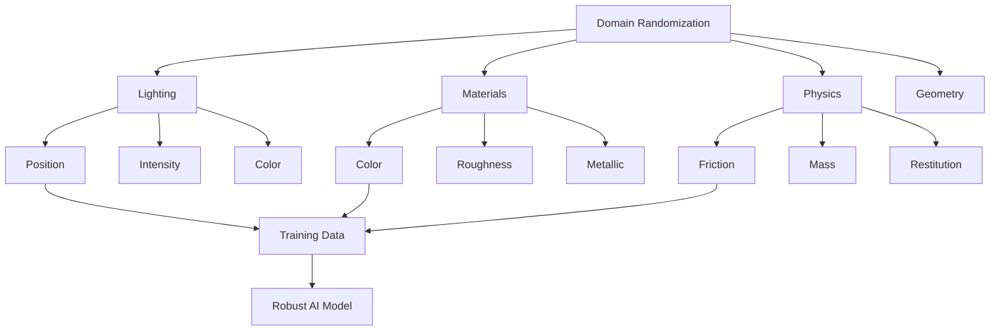

# Domain Randomization

## Learning Objectives

By the end of this chapter, you will be able to:
- Implement domain randomization techniques in Isaac Sim
- Generate synthetic training data with varied environmental conditions
- Bridge the sim-to-real gap using domain randomization
- Evaluate the effectiveness of domain randomization approaches

## Introduction

Domain randomization is a technique used to train robust AI models by randomizing various aspects of the simulation environment. This helps bridge the sim-to-real gap by exposing the AI to diverse conditions during training, making it more adaptable to real-world variations.

## Theory of Domain Randomization

### Theoretical Background

Domain randomization works by training AI models on data from randomized simulation environments, allowing the models to learn to focus on invariant features rather than environment-specific details. This makes the models more robust when deployed in real-world scenarios.

### Practical Implementation

In Isaac Sim, domain randomization can be applied to lighting conditions, object textures, physical properties, and environmental parameters to create diverse training data.

### Key Considerations

- Balance between diversity and realism
- Computational cost of randomization
- Validation of randomized environments

## Lighting Randomization

### Theoretical Background

Lighting conditions significantly affect perception-based tasks. By randomizing lighting, AI models learn to operate under various illumination conditions they might encounter in the real world.

### Practical Implementation

Lighting parameters such as position, intensity, color, and shadows can be randomized in Isaac Sim.

### Key Considerations

- Range of randomization should cover real-world possibilities
- Performance impact of complex lighting calculations
- Consistency across training episodes

## Material and Texture Randomization

### Theoretical Background

Objects in real environments have varying appearances. Material and texture randomization helps AI models focus on shape and structural features rather than specific visual textures.

### Practical Implementation

Materials can be randomized by changing color, roughness, metallic properties, and texture patterns in USD files.

### Key Considerations

- Physical plausibility of randomized materials
- Computational cost of complex material rendering
- Impact on sensor simulation

## Physical Property Randomization

### Theoretical Background

Real-world objects have variations in physical properties like friction, mass, and restitution. Randomizing these properties helps create more robust control policies.

### Practical Implementation

Physical properties can be adjusted through USD prim attributes and Isaac Sim's physics API.

### Key Considerations

- Range of randomization should be physically plausible
- Impact on simulation stability
- Validation against real-world measurements

## Diagrams and Visualizations



## Conceptual Code Examples

### Basic Domain Randomization Setup
```python
import numpy as np
import omni
from omni.isaac.core import World
from omni.isaac.core.utils.prims import get_prim_at_path
from omni.isaac.core.materials import VisualMaterial

class DomainRandomizer:
    def __init__(self, world: World):
        self.world = world
        self.light_prims = []
        self.object_prims = []

    def randomize_lighting(self):
        """Randomize lighting properties in the scene"""
        for light_prim in self.light_prims:
            # Randomize light intensity (between 100 and 1000)
            intensity = np.random.uniform(100, 1000)
            light_prim.GetAttribute("intensity").Set(intensity)

            # Randomize light color
            color = np.random.uniform(0.5, 1.0, 3)  # RGB values
            light_prim.GetAttribute("color").Set(color)

    def randomize_materials(self):
        """Randomize material properties of objects"""
        for obj_prim in self.object_prims:
            # Randomize object color
            color = np.random.uniform(0.1, 0.9, 3)
            # In a real implementation, we'd modify material properties
            # associated with this object

    def randomize_physics(self):
        """Randomize physics properties of objects"""
        for obj_prim in self.object_prims:
            # This would modify mass, friction, etc.
            # Example: randomize friction coefficient
            friction_range = [0.1, 1.0]
            friction = np.random.uniform(friction_range[0], friction_range[1])
            # Apply friction to the object's physics properties

    def randomize_scene(self):
        """Apply all randomizations to the scene"""
        self.randomize_lighting()
        self.randomize_materials()
        self.randomize_physics()

        # Step the world to apply changes
        self.world.step(render=False)
```

### Training Loop with Domain Randomization
```python
def training_loop_with_domain_randomization():
    # Initialize Isaac Sim world
    world = World(stage_units_in_meters=1.0)
    randomizer = DomainRandomizer(world)

    # Add objects to randomize
    # (In practice, you'd identify these from your scene)

    num_episodes = 1000

    for episode in range(num_episodes):
        # Randomize the scene at the beginning of each episode
        randomizer.randomize_scene()

        # Reset the world after randomization
        world.reset()

        # Run simulation episode
        for step in range(100):  # 100 steps per episode
            # Execute robot actions
            # Collect observations
            # Train model
            world.step(render=False)

    world.clear()
```

## Step-by-Step Tutorial

### Implementing Domain Randomization for Object Detection

#### Prerequisites

- Basic understanding of Isaac Sim
- Python programming skills
- Knowledge of computer vision concepts

#### Steps

1. Set up a simple scene with objects
2. Implement lighting randomization
3. Add material randomization
4. Create a training loop with randomization
5. Evaluate model performance

## Common Errors and Troubleshooting

### Error 1: Unstable Training
- **Cause**: Excessive randomization making learning difficult
- **Solution**: Reduce randomization range or add curriculum learning

### Error 2: Performance Degradation
- **Cause**: Complex randomization slowing down simulation
- **Solution**: Optimize randomization code or reduce frequency

### Error 3: Unrealistic Scenarios
- **Cause**: Randomization ranges too broad
- **Solution**: Validate randomization ranges against real-world data

## Hands-on Exercise

Implement domain randomization for a simple object detection task in Isaac Sim.

### Requirements
- Isaac Sim environment
- Basic computer vision knowledge
- Python programming skills

### Tasks
1. Create a scene with multiple objects
2. Implement lighting randomization
3. Add texture randomization
4. Create a training loop
5. Evaluate the effectiveness of randomization

### Expected Outcome
Students should have a working domain randomization system that improves model robustness.

## Summary

Domain randomization is a powerful technique for creating robust AI models that can handle real-world variations. Proper implementation requires balancing diversity with realism.

## Further Reading

- Domain randomization research papers
- Isaac Sim advanced tutorials
- Sim-to-real transfer techniques

## References

- Domain randomization seminal papers
- Isaac Sim documentation on randomization
- Synthetic data generation techniques