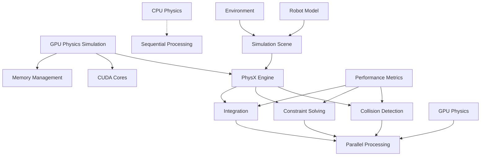

# GPU-Accelerated Physics

## Learning Objectives

By the end of this chapter, you will be able to:
- Configure and optimize GPU-accelerated physics in Isaac Sim
- Understand the benefits and limitations of GPU physics simulation
- Implement performance optimization strategies for physics simulation
- Evaluate the trade-offs between CPU and GPU physics computation

## Introduction

GPU-accelerated physics simulation in Isaac Sim leverages NVIDIA's PhysX engine to perform physics calculations on the GPU, enabling more complex and realistic simulations with higher performance than traditional CPU-based approaches. This chapter explores the technical aspects and practical applications of GPU-accelerated physics in robotics simulation.

## GPU Physics Architecture

### Theoretical Background

GPU physics simulation parallelizes the computation of physical interactions, allowing for simultaneous processing of multiple collision detection, constraint solving, and integration tasks. This parallelization can significantly increase the complexity of simulatable environments.

### Practical Implementation

Isaac Sim integrates PhysX GPU acceleration through CUDA, enabling the simulation of large-scale environments with many interacting objects.

### Key Considerations

- GPU memory requirements and limitations
- Performance scaling with scene complexity
- Numerical stability differences between CPU and GPU solvers

## PhysX GPU Features

### Theoretical Background

PhysX provides several GPU-specific features including GPU-accelerated collision detection, parallel constraint solving, and large-scale particle simulation for fluid and granular materials.

### Practical Implementation

GPU acceleration is enabled through PhysX configuration settings and appropriate scene setup that takes advantage of parallel processing.

### Key Considerations

- Scene complexity that benefits from GPU acceleration
- Memory management for large simulations
- Compatibility with different GPU architectures

## Performance Optimization

### Theoretical Background

Optimizing GPU physics requires understanding the balance between parallelization benefits and overhead costs, as well as memory access patterns and computational complexity.

### Practical Implementation

Performance optimization involves adjusting solver parameters, collision settings, and scene organization for optimal GPU utilization.

### Key Considerations

- Batch size optimization for parallel processing
- Memory allocation strategies
- Trade-offs between accuracy and performance

## Multi-Scene Simulation

### Theoretical Background

GPU acceleration enables running multiple simulation scenes in parallel, which is particularly valuable for training AI models that require diverse scenarios.

### Practical Implementation

Isaac Sim supports multiple parallel scenes through PhysX GPU contexts, allowing for efficient training data generation.

### Key Considerations

- Resource allocation across parallel scenes
- Synchronization requirements
- Memory management for multiple scenes

## Diagrams and Visualizations



## Conceptual Code Examples

### Configuring GPU Physics in Isaac Sim
```python
import omni
from omni.isaac.core import World
from omni.isaac.core.utils.settings import set_physics_dt
from omni.physx import get_physx_interface
from omni.isaac.core.utils.stage import add_reference_to_stage
from omni.isaac.core.utils.nucleus import get_assets_root_path

def setup_gpu_physics_simulation():
    # Create world with specific settings for GPU physics
    world = World(
        stage_units_in_meters=1.0,
        physics_dt=1.0/60.0,  # Physics timestep
        rendering_dt=1.0/60.0,  # Rendering timestep
        sim_params={
            "use_gpu": True,  # Enable GPU physics
            "use_gpu_dynamics": True,  # GPU dynamics
            "use_gpu_collision": True,  # GPU collision detection
            "solver_type": 1,  # 0: PGS, 1: TGS
            "bounce_threshold_velocity": 0.5,
            "friction_offset_threshold": 0.04,
            "friction_correlation_distance": 0.025,
            "gpu_max_rigid_contact_count": 524288,
            "gpu_max_rigid_patch_count": 33554432,
            "gpu_found_lost_pairs_capacity": 1024,
            "gpu_total_aggregate_pairs_capacity": 1024,
            "gpu_max_soft_body_contacts": 1024,
            "gpu_max_particle_contacts": 1024,
            "gpu_heap_capacity": 67108864,
            "gpu_temp_buffer_size": 16777216,
            "gpu_max_num_partitions": 8
        }
    )

    # Additional GPU-specific settings
    physx_interface = get_physx_interface()
    if physx_interface:
        # Configure GPU memory settings
        physx_interface.set_parameter("gpu.maxRigidContactCount", 524288)
        physx_interface.set_parameter("gpu.maxRigidPatchCount", 33554432)

    # Add objects to the simulation
    assets_root_path = get_assets_root_path()
    if assets_root_path is not None:
        # Add a robot
        add_reference_to_stage(
            usd_path=assets_root_path + "/Isaac/Robots/Carter/carter_model.usd",
            prim_path="/World/Carter"
        )

        # Add multiple objects for complex physics
        for i in range(10):
            add_reference_to_stage(
                usd_path=assets_root_path + "/Isaac/Props/Block/block_instanceable.usd",
                prim_path=f"/World/Block_{i}"
            )

    # Reset and run simulation
    world.reset()

    # Performance monitoring
    for i in range(1000):
        world.step(render=True)
        if i % 100 == 0:
            print(f"Simulation step {i} completed")

    world.clear()
```

### Performance Comparison Function
```python
import time
import numpy as np

def compare_cpu_gpu_physics():
    """Compare performance between CPU and GPU physics"""

    # Setup for CPU physics
    cpu_world = World(
        stage_units_in_meters=1.0,
        sim_params={
            "use_gpu": False,
            "use_gpu_dynamics": False,
            "use_gpu_collision": False
        }
    )

    # Setup for GPU physics
    gpu_world = World(
        stage_units_in_meters=1.0,
        sim_params={
            "use_gpu": True,
            "use_gpu_dynamics": True,
            "use_gpu_collision": True
        }
    )

    # Add same scene to both worlds
    # (Scene setup code here)

    # Benchmark CPU physics
    cpu_world.reset()
    start_time = time.time()
    for i in range(500):
        cpu_world.step(render=False)
    cpu_time = time.time() - start_time

    # Benchmark GPU physics
    gpu_world.reset()
    start_time = time.time()
    for i in range(500):
        gpu_world.step(render=False)
    gpu_time = time.time() - start_time

    print(f"CPU Physics Time: {cpu_time:.2f}s")
    print(f"GPU Physics Time: {gpu_time:.2f}s")
    print(f"Speedup: {cpu_time/gpu_time:.2f}x")

    cpu_world.clear()
    gpu_world.clear()
```

## Step-by-Step Tutorial

### Optimizing Physics Simulation Performance

#### Prerequisites

- Isaac Sim installed with GPU support
- Understanding of physics simulation concepts
- NVIDIA GPU with CUDA support

#### Steps

1. Configure GPU physics settings
2. Set up a complex scene with multiple objects
3. Measure baseline performance
4. Apply optimization techniques
5. Evaluate performance improvements

## Common Errors and Troubleshooting

### Error 1: GPU Memory Exhaustion
- **Cause**: Scene too complex for available GPU memory
- **Solution**: Reduce scene complexity or adjust memory settings

### Error 2: Physics Instability
- **Cause**: GPU solver parameters not properly configured
- **Solution**: Adjust solver parameters and timestep settings

### Error 3: Performance Degradation
- **Cause**: Scene not optimized for GPU parallelization
- **Solution**: Reorganize scene for better parallel processing

## Hands-on Exercise

Set up and optimize a complex physics simulation using GPU acceleration.

### Requirements
- Isaac Sim with GPU support
- Compatible NVIDIA GPU
- Understanding of physics concepts

### Tasks
1. Configure GPU physics parameters
2. Create a complex scene with many interacting objects
3. Measure performance baseline
4. Apply optimization techniques
5. Compare CPU vs GPU performance

### Expected Outcome
Students should have a working GPU-accelerated physics simulation with measured performance improvements.

## Summary

GPU-accelerated physics in Isaac Sim enables complex, realistic simulations by leveraging parallel processing capabilities of modern GPUs. Proper configuration and optimization are essential for realizing performance benefits.

## Further Reading

- PhysX GPU programming guide
- Isaac Sim performance optimization
- GPU computing for robotics simulation

## References

- NVIDIA PhysX documentation
- CUDA programming guide
- GPU-accelerated robotics simulation research