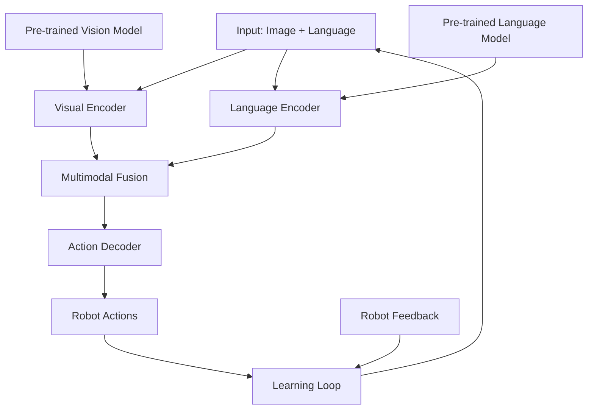

# VLA Model Architectures

## Learning Objectives

By the end of this chapter, you will be able to:
- Understand the key architectural components of Vision-Language-Action models
- Compare different VLA model architectures and their trade-offs
- Implement basic components of VLA systems
- Evaluate the capabilities and limitations of different architectures

## Introduction

Vision-Language-Action (VLA) models represent a paradigm shift in robotics, where robots can understand and execute complex tasks described in natural language while perceiving and interacting with their environment. This chapter explores the architectures that enable this multimodal integration.

## Transformer-Based Architectures

### Theoretical Background

Transformer architectures form the backbone of most modern VLA models, leveraging attention mechanisms to process and integrate information across modalities. These models typically use separate encoders for vision and language, with a shared action decoder.

### Practical Implementation

Transformer-based VLA models use cross-attention mechanisms to allow visual and linguistic information to influence each other, followed by action generation through specialized output heads.

### Key Considerations

- Computational requirements for large transformer models
- Training data requirements for multimodal alignment
- Fine-tuning strategies for specific robotic tasks

## Multimodal Fusion Strategies

### Theoretical Background

Effective VLA models require sophisticated methods to combine information from visual, linguistic, and action modalities. Fusion can occur at different levels: early fusion, late fusion, or intermediate fusion with cross-attention.

### Practical Implementation

Fusion strategies are implemented through attention mechanisms, concatenation operations, or specialized fusion layers that learn to weight information from different modalities appropriately.

### Key Considerations

- Computational efficiency of different fusion approaches
- Preservation of modality-specific information
- Handling of variable-length inputs

## Pre-trained Foundation Models

### Theoretical Background

Most VLA models build upon pre-trained vision and language models (like CLIP, ViT, GPT) to leverage existing knowledge and reduce training requirements. These foundation models provide robust representations that can be adapted for robotic tasks.

### Practical Implementation

Pre-trained models are typically frozen or partially fine-tuned while adding task-specific components for action generation and multimodal integration.

### Key Considerations

- Transfer learning effectiveness from pre-trained representations
- Domain adaptation for robotic environments
- Computational efficiency of large pre-trained models

## End-to-End Learning Approaches

### Theoretical Background

Some VLA models are trained end-to-end on robotic data, learning joint representations for vision, language, and action simultaneously. This approach can potentially discover more effective representations but requires large amounts of robotic data.

### Practical Implementation

End-to-end models typically use reinforcement learning, imitation learning, or behavior cloning to train the complete system from raw sensory inputs to actions.

### Key Considerations

- Data efficiency compared to foundation model approaches
- Generalization capabilities across different tasks
- Computational requirements for training

## Diagrams and Visualizations



## Conceptual Code Examples

### Basic VLA Model Architecture
```python
import torch
import torch.nn as nn
import torchvision.models as models

class VLAModel(nn.Module):
    def __init__(self, vocab_size, action_space_dim, hidden_dim=512):
        super(VLAModel, self).__init__()

        # Visual encoder (using pre-trained ResNet)
        self.visual_encoder = models.resnet50(pretrained=True)
        self.visual_encoder.fc = nn.Linear(self.visual_encoder.fc.in_features, hidden_dim)

        # Language encoder (simplified transformer)
        self.language_encoder = nn.TransformerEncoder(
            nn.TransformerEncoderLayer(d_model=hidden_dim, nhead=8),
            num_layers=6
        )
        self.lang_embedding = nn.Embedding(vocab_size, hidden_dim)

        # Multimodal fusion layer
        self.fusion_layer = nn.Linear(hidden_dim * 2, hidden_dim)

        # Action decoder
        self.action_decoder = nn.Sequential(
            nn.Linear(hidden_dim, hidden_dim),
            nn.ReLU(),
            nn.Linear(hidden_dim, action_space_dim)
        )

    def forward(self, images, language_tokens):
        # Encode visual information
        visual_features = self.visual_encoder(images)
        visual_features = torch.relu(visual_features)

        # Encode language information
        lang_embeds = self.lang_embedding(language_tokens)
        lang_features = self.language_encoder(lang_embeds.transpose(0, 1))
        lang_features = lang_features.mean(dim=0)  # Average across sequence

        # Fuse multimodal information
        fused_features = torch.cat([visual_features, lang_features], dim=1)
        fused_features = torch.relu(self.fusion_layer(fused_features))

        # Generate actions
        actions = self.action_decoder(fused_features)

        return actions

# Example usage
def create_vla_agent():
    model = VLAModel(vocab_size=10000, action_space_dim=7)  # 7-DOF robot arm
    return model
```

### Cross-Modal Attention Mechanism
```python
import torch
import torch.nn as nn

class CrossModalAttention(nn.Module):
    def __init__(self, hidden_dim):
        super(CrossModalAttention, self).__init__()
        self.hidden_dim = hidden_dim

        # Query, key, value projections for cross-attention
        self.vision_to_q = nn.Linear(hidden_dim, hidden_dim)
        self.lang_to_k = nn.Linear(hidden_dim, hidden_dim)
        self.lang_to_v = nn.Linear(hidden_dim, hidden_dim)

        self.scale = hidden_dim ** -0.5  # For scaled dot-product attention

    def forward(self, vision_features, lang_features):
        # vision_features: [batch_size, vision_seq_len, hidden_dim]
        # lang_features: [batch_size, lang_seq_len, hidden_dim]

        # Create query from vision, key and value from language
        Q = self.vision_to_q(vision_features)  # [B, V_len, H]
        K = self.lang_to_k(lang_features)     # [B, L_len, H]
        V = self.lang_to_v(lang_features)     # [B, L_len, H]

        # Compute attention scores
        attention_scores = torch.matmul(Q, K.transpose(-2, -1)) * self.scale
        attention_weights = torch.softmax(attention_scores, dim=-1)

        # Apply attention to get context-aware vision features
        attended_features = torch.matmul(attention_weights, V)

        return attended_features
```

## Step-by-Step Tutorial

### Implementing a Basic VLA Component

#### Prerequisites

- PyTorch knowledge
- Understanding of neural networks
- Basic robotics concepts

#### Steps

1. Set up the environment with required libraries
2. Implement visual encoder component
3. Implement language encoder component
4. Create multimodal fusion mechanism
5. Add action generation head
6. Test the integration

## Common Errors and Troubleshooting

### Error 1: Modality Misalignment
- **Cause**: Visual and language features not properly aligned
- **Solution**: Ensure consistent feature dimensions and proper normalization

### Error 2: Training Instability
- **Cause**: Large model with multimodal inputs causing gradient issues
- **Solution**: Use gradient clipping and proper initialization

### Error 3: Computational Bottlenecks
- **Cause**: Large models requiring significant computational resources
- **Solution**: Optimize batch processing and use appropriate hardware

## Hands-on Exercise

Implement a simplified VLA model component for a specific robotic task.

### Requirements
- PyTorch installed
- Basic understanding of neural networks
- Robotic environment (simulated)

### Tasks
1. Implement visual encoder for robot camera input
2. Create language processing component
3. Design multimodal fusion layer
4. Implement action generation head
5. Test integration with simple commands

### Expected Outcome
Students should have a working VLA component that can process visual and language inputs to generate actions.

## Summary

VLA model architectures combine vision, language, and action processing through sophisticated neural network designs. Understanding these architectures is crucial for implementing effective robotic systems that can understand natural language commands.

## Further Reading

- Vision-Language-Action model research papers
- Transformer architectures for robotics
- Multimodal deep learning techniques

## References

- RT-1: Robotics Transformer paper
- BC-Z behavioral cloning research
- CLIP and multimodal pre-training research