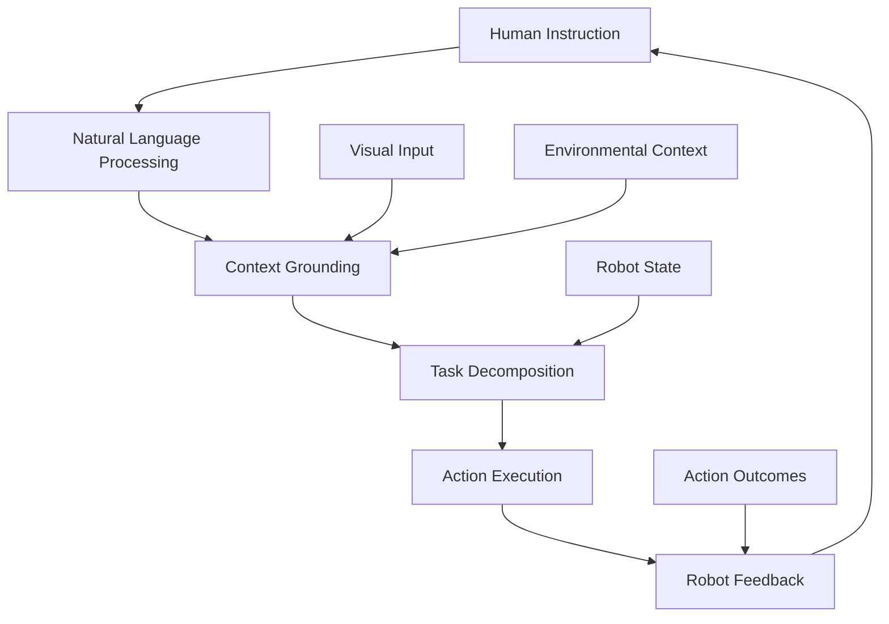

# Human-Robot Interaction through VLA

## Learning Objectives

By the end of this chapter, you will be able to:
- Design natural language interfaces for robot control
- Implement intent recognition and task decomposition systems
- Create feedback mechanisms for human-robot communication
- Evaluate the effectiveness of VLA-based human-robot interaction

## Introduction

Vision-Language-Action models enable natural human-robot interaction by allowing humans to communicate with robots using natural language while the robot perceives its environment and executes appropriate actions. This chapter explores how VLA models facilitate intuitive human-robot communication and collaboration.

## Natural Language Understanding for Robotics

### Theoretical Background

Natural language understanding in robotics involves parsing human commands, identifying relevant objects and actions, and translating linguistic descriptions into executable robot behaviors. VLA models excel at this by grounding language in visual context.

### Practical Implementation

Robotic NLU systems use VLA models to interpret commands within environmental context, disambiguating instructions based on what the robot can perceive.

### Key Considerations

- Context-dependent interpretation of commands
- Handling ambiguous or underspecified instructions
- Robustness to linguistic variations

## Task Decomposition and Planning

### Theoretical Background

Complex human instructions need to be decomposed into sequences of primitive robot actions. VLA models can learn to break down high-level goals into executable subtasks while considering environmental constraints.

### Practical Implementation

Task decomposition in VLA systems involves predicting intermediate goals and subtasks that lead to the overall objective described in natural language.

### Key Considerations

- Hierarchical planning and subtask generation
- Handling of contingent actions and feedback
- Integration with traditional planning systems

## Context Grounding

### Theoretical Background

Context grounding refers to the ability of a robot to understand language references in relation to its current environment and situation. This is crucial for interpreting spatial references, object references, and contextual commands.

### Practical Implementation

VLA models use attention mechanisms to focus on relevant environmental features when interpreting language, creating joint representations of visual and linguistic information.

### Key Considerations

- Real-time processing requirements
- Handling of dynamic environments
- Memory mechanisms for maintaining context

## Feedback and Clarification Systems

### Theoretical Background

Effective human-robot interaction requires robots to provide feedback about their understanding and actions, as well as request clarification when instructions are ambiguous or unclear.

### Practical Implementation

Feedback systems in VLA robots can generate natural language responses or visual indicators to communicate their state and understanding to humans.

### Key Considerations

- Timing and relevance of feedback
- Appropriate level of detail in responses
- Proactive clarification strategies

## Diagrams and Visualizations



## Conceptual Code Examples

### Natural Language Interface for Robot Control
```python
import torch
import re
from typing import Dict, List, Tuple

class VLAHumanRobotInterface:
    def __init__(self, vla_model):
        self.vla_model = vla_model
        self.command_patterns = {
            'move_to': [r'move to (.+)', r'go to (.+)', r'go over to (.+)'],
            'pick_up': [r'pick up (.+)', r'grab (.+)', r'get (.+)'],
            'place_at': [r'place (.+) at (.+)', r'put (.+) on (.+)'],
            'follow': [r'follow (.+)', r'go behind (.+)']
        }

    def parse_command(self, command: str) -> Dict:
        """Parse natural language command into structured format"""
        command = command.lower().strip()

        for action_type, patterns in self.command_patterns.items():
            for pattern in patterns:
                match = re.search(pattern, command)
                if match:
                    return {
                        'action': action_type,
                        'arguments': match.groups()
                    }

        return {
            'action': 'unknown',
            'arguments': [command]
        }

    def execute_command(self, command: str, visual_input, robot_state) -> Dict:
        """Execute command using VLA model with visual context"""
        parsed_cmd = self.parse_command(command)

        if parsed_cmd['action'] == 'unknown':
            return {
                'status': 'clarification_needed',
                'message': f"I don't understand: '{command}'. Can you rephrase?"
            }

        # Use VLA model to generate actions based on command and visual input
        actions = self.vla_model(visual_input, command, robot_state)

        return {
            'status': 'executing',
            'actions': actions,
            'parsed_command': parsed_cmd
        }

    def get_feedback(self, action_result) -> str:
        """Generate natural language feedback about action execution"""
        if action_result.get('success', False):
            return "Task completed successfully."
        else:
            error_msg = action_result.get('error', 'Unknown error occurred')
            return f"I encountered an issue: {error_msg}. Can you provide more details?"
```

### Context Grounding Example
```python
import torch
import torch.nn as nn
import numpy as np

class ContextGroundingModule(nn.Module):
    def __init__(self, hidden_dim=512):
        super(ContextGroundingModule, self).__init__()
        self.hidden_dim = hidden_dim

        # Visual encoder for scene understanding
        self.visual_encoder = nn.Sequential(
            nn.Conv2d(3, 64, kernel_size=8, stride=4),
            nn.ReLU(),
            nn.Conv2d(64, 128, kernel_size=4, stride=2),
            nn.ReLU(),
            nn.Conv2d(128, 256, kernel_size=3, stride=1),
            nn.ReLU(),
            nn.AdaptiveAvgPool2d((1, 1)),
            nn.Flatten(),
            nn.Linear(256, hidden_dim)
        )

        # Language encoder for command understanding
        self.lang_encoder = nn.Sequential(
            nn.Linear(hidden_dim, hidden_dim),
            nn.ReLU(),
            nn.Linear(hidden_dim, hidden_dim)
        )

        # Cross-modal attention for grounding
        self.attention = nn.MultiheadAttention(
            embed_dim=hidden_dim,
            num_heads=8
        )

        # Object detection component
        self.object_detector = nn.Linear(hidden_dim, 10)  # 10 object classes

    def forward(self, visual_input, language_input):
        # Encode visual scene
        visual_features = self.visual_encoder(visual_input)

        # Encode language command
        lang_features = self.lang_encoder(language_input)

        # Apply cross-modal attention for grounding
        # Reshape for attention mechanism
        visual_seq = visual_features.unsqueeze(0)  # Add sequence dimension
        lang_seq = lang_features.unsqueeze(0)

        # Attend visual features based on language
        attended_visual, attention_weights = self.attention(
            visual_seq, lang_seq, lang_seq
        )

        # Detect objects relevant to the command
        object_probs = torch.softmax(
            self.object_detector(attended_visual.squeeze(0)),
            dim=-1
        )

        return {
            'grounded_features': attended_visual,
            'object_probabilities': object_probs,
            'attention_weights': attention_weights
        }
```

## Step-by-Step Tutorial

### Creating a Natural Language Robot Interface

#### Prerequisites

- Understanding of VLA concepts
- Basic Python programming
- Familiarity with robotics simulation

#### Steps

1. Set up the natural language parsing component
2. Integrate with visual processing
3. Implement task decomposition logic
4. Add feedback generation
5. Test with sample commands

## Common Errors and Troubleshooting

### Error 1: Misinterpretation of Commands
- **Cause**: Language model not properly grounded in visual context
- **Solution**: Improve visual-language alignment training

### Error 2: Ambiguous Reference Resolution
- **Cause**: Robot cannot identify which object is being referenced
- **Solution**: Implement object tracking and disambiguation

### Error 3: Feedback Inconsistencies
- **Cause**: Robot feedback doesn't match actual behavior
- **Solution**: Ensure feedback system is synchronized with action execution

## Hands-on Exercise

Implement a natural language interface for a simulated robot that can understand and execute simple commands.

### Requirements
- Robotics simulation environment
- Natural language processing tools
- Basic programming skills

### Tasks
1. Implement command parsing for basic actions
2. Create visual context grounding
3. Design feedback mechanism
4. Test with various natural language commands
5. Evaluate system performance

### Expected Outcome
Students should have a working system that can interpret natural language commands and execute corresponding robot actions with appropriate feedback.

## Summary

VLA models enable natural human-robot interaction by grounding language understanding in visual context and generating appropriate actions. Effective systems require robust natural language processing, context grounding, and feedback mechanisms.

## Further Reading

- Human-robot interaction research in VLA systems
- Natural language interfaces for robotics
- Context-aware robotics systems

## References

- Language grounding in robotics research
- Human-robot interaction guidelines
- VLA model implementation studies